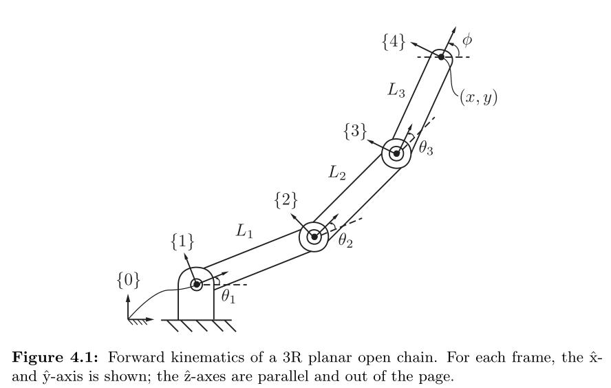
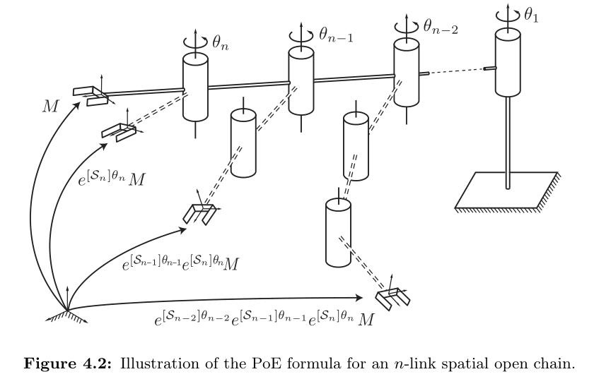
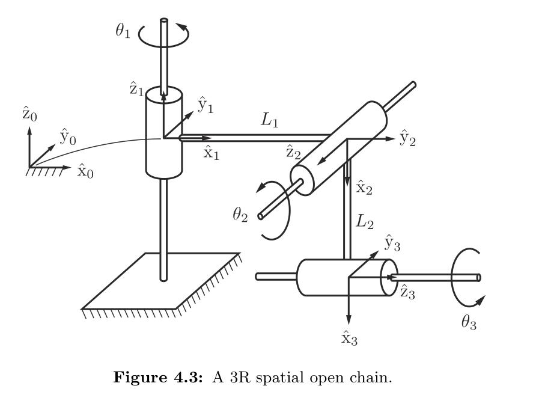

---
title: Forward Kinematics
author: |
    | Alex Nilles
    | Modern Robotics Chapter 4
date: October 1, 2025
...

## What is "Forward Kinematics"?

**Kinematics**: a branch of *classical mechanics* that describes motion of
bodies without considering forces. AKA "the geometry of motion"

**Forward kinematics**: a specific problem in robotics. Given the individual state of each
joint of the robot (in a local frame), what is the position of a
given point on the robot in the global frame?

## Assumptions

- Our robot is a kinematic chain, made of rigid *links* connected by movable *joints*
- No branches or loops (will discuss later)
- All joints have one degree of freedom and are *revolute* or *prismatic*

# Screw Motions

Definition 3.24 from Modern Robotics:  a **screw axis** $\mathcal{S}$ is written as

$$
\mathcal{S} = \begin{bmatrix} \omega \\ v \end{bmatrix} \in \mathbb{R}^6
$$

where for our purposes of revolute and prismatic joints, we have either

- $\lvert \lvert \omega \rvert \rvert = 1$
   - where $v = -\omega \times q + h\omega$, where $q$ is a point on
       the axis of the screw and $h$ is the pitch of the screw ($h=0$ for a pure
       rotation about the screw axis). OR
- $\lvert \lvert \omega \rvert \rvert = 0$ and $\lvert \lvert v \rvert \rvert = 1$
   -  where the pitch of the screw is infinite and the motion is a translation along the axis defined by $v$.

## Modelling Robot Joints as Screw Motions

**Revolute Joints:**

- $\lvert \lvert \omega \rvert \rvert = 1$
   - where $v = -\omega \times q + h\omega$, where $q$ is a point on
       the axis of the screw and $h$ is the pitch of the screw **($h=0$ for a pure
       rotation about the screw axis)**.
   - So for revolute joints, $\omega$ is axis of rotation and $v = -\omega \times q$

## Modelling Robot Joints as Screw Motions

**Prismatic Joints**

- $\lvert \lvert \omega \rvert \rvert = 0$ and $\lvert \lvert v \rvert \rvert = 1$
   -  where the pitch of the screw is infinite and the motion is a
        translation along the axis defined by $v$.
   - **prismatic joints** defined by axis of movement $v$

## Product of Exponentials Approach

**Key Idea:** Model each joint as applying a screw motion to all links beyond
it.

## Product of Exponentials Approach

Let each joint $i$ have an associated parameter $\theta_i$ that defines its
configuration (rotation angle for revolute joints, translation amount for
prismatic).

Initialization:

- Choose a fixed, global base frame $\{s\}$
- Choose an "end effector" frame $\{b\}$ fixed to the robot
- Put all joints in "zero position"
- Let $M \in SE(3)$ be the configuration of $\{b\}$ in the $\{s\}$ frame when
robot is in zero position

## Product of Exponentials Formula

For each joint $i$, define the screw axis.

For each motion of a joint, define the screw motion.

This form composes nicely through multiplication, giving us the **Product of
Exponentials (PoE)** formula!

$$
T(\theta) = e^{[\mathcal{S_1}]\theta_1} \ldots
e^{[\mathcal{S_{n-1}}]\theta_{n-1}} e^{[\mathcal{S_{n}}]\theta_{n}} M
$$

## Screw Motions as Matrix Exponential

The screw axis $\mathcal{S}$ can be expressed in matrix form as

$$
[\mathcal{S}_i] = \begin{bmatrix}
[\omega_i] & v \\
0 & 0
\end{bmatrix} \in se(3)
$$

where $[ \ldots ]$ is the skew symmetric form.

To express a **screw motion** given a screw axis, we use the matrix exponential

$$
e^{\left[\mathcal{S}\right] \theta} \in SE(3)
$$

which is a homogenous transformation and can be expressed in matrix form.

## Form of Matrix Exponential

- Actually computing the matrix exponential is not straight forward. The formal definition is given by the power series, $e^X = \sum_{k=0}^\infty
\frac{1}{k!} X^k$.

- Luckily, our screw motion has structure, leading us to find a finite
closed-form expression for each type of joint.

**Revolute Joints:**

Let $S = (\omega, v)$ be a screw axis. If $||\omega|| = 1$ (the condition that
revolute joints meet), then we have

$$
e^{[S]\theta} = \begin{bmatrix}
e^{[\omega]\theta} & (I \theta + (1-\cos \theta) [\omega\] + (\theta -
\sin \theta ) [\omega]^2) v \\
0 & 1
\end{bmatrix}
$$

**Prismatic Joints**

In the case of prismatic joints (with only linear motion), we have $\omega=0$ a
nd $||v|| = 1$, and our screw motion simplifies to

$$
e^{[S]\theta} = \begin{bmatrix}
I & v\theta \\
0 & 1
\end{bmatrix}
$$

## Visualizing the Formula

## Example 1

$$
M = \begin{bmatrix}
1 & 0 & 0 & L_1 + L_2 + L_3 \\
0 & 1 & 0 & 0 \\
0 & 0 & 1 & 0 \\
0 & 0 & 0 & 1 \\
\end{bmatrix}
$$

All axes:

$\omega_i = (0,0,1)$

For each joint:

$v_1 = (0,0,0)$

$v_2 = (0,-L,0)$

$v_3 = (0,-(L_1 + L_2),0)$

Form $e^{[\mathcal{S_i}] \theta}$ for each joint:

$$
e^{[\mathcal{S_i}] \theta} = \begin{bmatrix} 
e^{[\omega_i] \theta} & (I \theta + (1 - \cos(\theta) [\omega_i] + (\theta -
\sin(\theta) [\omega_i]^2) v_i \\
0 & 1
\end{bmatrix}
$$

And compose with $M$

$$
T(\theta) = e^{[\mathcal{S_1}]\theta_1}
e^{[\mathcal{S_{2}}]\theta_{2}} e^{[\mathcal{S_{3}}]\theta_{3}} M
$$

## Example 2

First find $M$:

$$
M = \begin{bmatrix}
0 & 0 & 1 & L_1 \\
0 & 1 & 0 & 0 \\
-1 & 0 & 1 & -L_2 \\
0 & 0 & 0 & 1 \\
\end{bmatrix}
$$

For joint 1: $\omega_1 = (0,0,1) \qquad v_1 = (0,0,0)$

For joint 2: $\omega_2 = (0, -1, 0) \qquad q_2 = (L_1, 0, 0) \qquad v_2 = (0, 0, -L_1)$

For joint 3: $\omega_3 = (1, 0, 0) \qquad q_3 = (0, 0, -L_2) \qquad v_3 = (0, -L_2, 0)$

